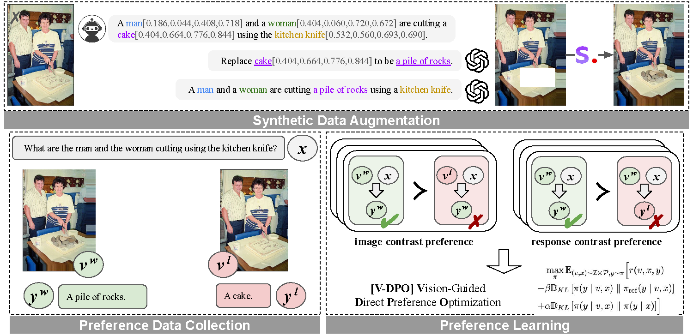

# Vision-Guided Direct Preference Optimization

This repository contains code and analysis for the paper: [V-DPO: Mitigating Hallucination in Large Vision Language Models via Vision-Guided Direct Preference Optimization](). 
Below is the framework of our proposed method (including data collection and preference learning).



## Environment Setup

```sh
conda env create --file llava_dpo.yaml
```

## Run V-DPO

Our main code include `./llava_dpo/train/dpo_train.py` and `./llava_dpo/train/llava_trainer.py`

To run V-DPO on RLHF-V dataset:
```sh
bash scripts/v1_5/vdpo.sh
```


## Citation

```
@article{xie2024monte,
  title={V-DPO: Mitigating Hallucination in Large Vision Language Models via Vision-Guided Direct Preference Optimization},
  author={Xie, Yuxi and Li, Guanzhen and Xu, Xiao and Kan, Min-Yen},
  year={2024}
}
```

---
<sub><sup>This repository is adapted from the code of the works [LLaVA](https://github.com/haotian-liu/LLaVA). </sup></sub>
